[](https://classroom.github.com/online_ide?assignment_repo_id=10252313&assignment_repo_type=AssignmentRepo)
# **Assignment 1 - Building a simple image search algorithm**
## **Cultural Data Science - Visual Analytics** 
#### Author: Rikke Uldbæk (202007501)
#### Date: 23rd of February 2023
<br>

# **1.1 GitHub link**
The following link is a link to the GitHub repository of assignment 1 in the course Visual Analytics (F23.147201U023.A). Within the GitHub repository all necessary code are provided to reproduce the results of the assignment. 

https://github.com/rikkeuldbaek/assignment1-simple-image-search-rikkeuldbaek

<br>

# **1.2 Description**
For this assignment, I have created two image search algorithms that finds the top 5 images that resembles a chosen *target image* the most. First, I have used ```OpenCV``` to design a simple image search algorithm, in which colour histograms of images are compared to detect similarity between images. Second, I have used ```VGG16``` and the ```K-Nearest Neighbor algorithm``` to design a more complex algorithm, in which features of images are extracted and compared to detect similarity.

<br>

# **1.3 Methods** <br>
### **Simple search algorithm** <br>
The simple search algorithm calculates a colour histogram with distributions of pixel intensities across each channel for both the *target image* and the remaining images. Then the simple search algorithm normalizes the colour histograms and finally compares the normalized colour histogram of the *target image* to the normalized colour histograms of the remaining images. The normalization is done using MinMax and the comparison of histograms applies the chi-square distance method. 

The simple search algorithm is written as a function, which takes any input filename (*target image*) from a user and then produces new results displaying the top 5 most similar flowers for the chosen filename (*target image*). The function produces a .csv file of the top 5 similar flowers with their distance metrics, while saving the similar images and target image in the folder ```out/simple_search_out```.

<br>

### **Complex image search algorithm** <br>
The more complex image search algorithm uses both the model *VGG16* and *K-Nearest Neighbor algorithm*. The *VGG16* model without classification layers is soley used for feature extraction in this assignment, hence is used to extract flower features for all the images. Then I apply the *K-Nearest Neighbor algorithm* to all the extracted features, and the algorithm computes a cosine distance for every image including the *target image*. Then the cosine distance of the *target image* is compared to the cosine distances of the remaining images to find the top 5 images that resembles the *target image* the most. 

This complex image search algorithm is written as a script, which takes a filename of a chosen *target image* as an argument. Hence, the user can change the default filename (*target image*) and then the script produces new results based on the input of the user. These results are similairly a metrics .csv file and the top 5 similar images, including the *target image*. These results are saved in ```out/VGG16_KNearestNeigh_out```.

<br>

# **1.4 Data**
The dataset is a collection of over 1000 images of flowers sampled from 17 different species of flowers. The dataset comes from the Visual Geometry Group at the University of Oxford, and a link to the full details of the data can found in the resources section.

<br>

# **1.5 Repository Structure**
|Folder name|Description|Content|
|---|---|---|
|```notebook```|.ipynb notebook with code for the simple image search algorithm|```simple_image_search.ipynb```|
|```src```| script with code for the complex image search algorithm|```image_search_VGG16_KNearestNeigh.py```|
|```data```|.jpg files of flowers|```flowers``` folder|
|```out/simple_search_out```|.jpg files of top 5 similar flowers, target image and their distance metric as .csv file |```top5.csv```, ```image_0022.jpg```,```image_0742.jpg```, ```image_0798.jpg```,```image_0910.jpg```, ```image_0949.jpg```, ```target_image.jpg```|
|```out/VGG16_KNearestNeigh_out```|.jpg files of top 5 similar flowers, target image and their distance metric as .csv file |```top5_VGG16_KNear.csv```, ```image_0014.jpg```,```image_0016.jpg```, ```image_0049.jpg```,```image_1041.jpg```, ```image_1143.jpg```, ```target_image.jpg```|

<br>

# **1.6 Usage and Reproducibility**
## **1.6.1 Prerequisites** 
In order for the user to be able to run the code, please make sure to have bash and python 3 installed on the used device. The code has been written and tested with Python 3.9.2 on a Linux operating system. In order to run the provided code for this assignment, please follow the instructions below.

<br>

## **1.6.2 Setup Instructions** 
**1) Clone the repository**
```python
git clone https://github.com/rikkeuldbaek/assignment1-simple-image-search-rikkeuldbaek
 ```

 **2) Setup** <br>
Setup virtual environment (```VA1_env```) and install packages.
```python
bash setup.sh
```
<br>

## **1.6.3 Running the scripts** 
### **Run the Simple Image Search Algorithm** <br>
Please open the folder ```notebook``` and open the ```simple_image_search.ipynb``` script and press "Run All". The *target image* can be modified in chunk 3:
````python
compare_top5_hist("target_image") # specify user-specific target image here
````

<br>

### **Run the Complex Image Search Algorithm** <br>
The command below will automatically run the ```image_search_VGG16_KNearestNeigh.py```script and produce the described results.
```python
bash run.sh
```

However, for the user to change the filename of the *target image* please specify this in the ```run.sh``` script:
```python
python3 src/image_search_VGG16_KNearestNeigh.py --target_flower_image # specify user-specific target image here
```

The ```image_search_VGG16_KNearestNeigh.py``` takes the following arguments:
|Argument|Type|Default|
|---|---|---|
|--target_flower_image|str|image_0021.jpg|


<br>


# **1.7 Results**
I have used the same *target image* for both the Simple Image Search Algorithm and the Complex Image Search Algorithm, namely image "image_0021.jpg" which is an image of a daffodil flower.  

|Target Image|
|---|
|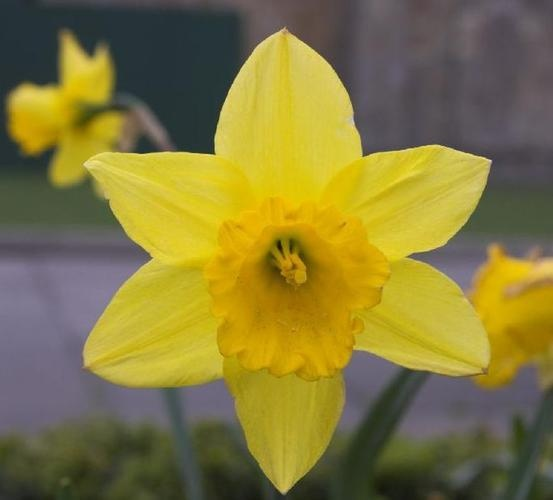|

<br>

## **1.7.1 Results of the Simple Image Search Algorithm**

The default chosen *target image* in this assignment is an image of a daffodil flower. However, when searching for the top 5 most resembling flowers using the simple image search algorithm, only one within the top 5 is actually a daffodil. The simple image search algorithm does not seem to be able to distinguish between flower species, hence the result. However, the five flowers found by the image search algorithm do actually take up the circa same porportion of yellow pixels in the images, and this could be reason for why these exact five flowers is found to resemble my *target image* of a daffodil. 

Below I have displayed the distance metric and the images of the five flowers which are most similar to my *target image*. The smaller the value in the distance metric the greater similarity to the *target image*.

**Top 5 Similar Flowers - Simple Image Search Algorithm**
||||||
|---|---|---|---|---|
|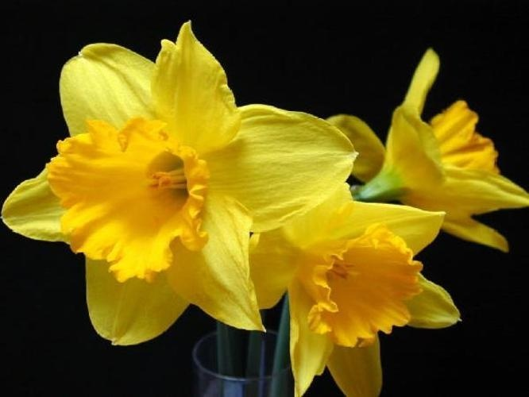|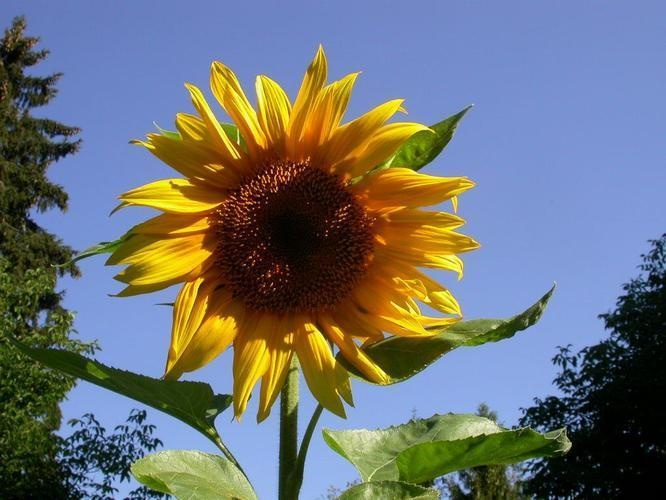|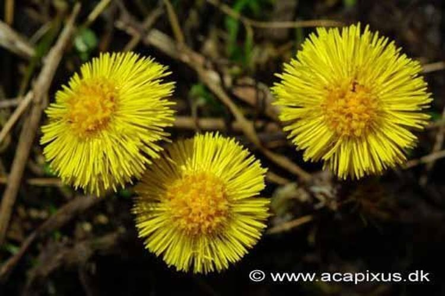|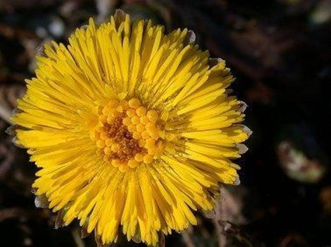|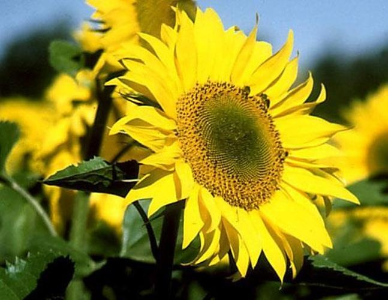|

**Distance Metric - Simple Image Search Algorithm**
|Filename|Distance|
|---|---|
|image_0949.jpg|81.96|
|image_0798.jpg|82.57|
|image_0022.jpg|82.65|
|image_0742.jpg|82.91|
|image_0910.jpg|83.16|

<br>

## **1.7.2 Results of the Complex Image Search Algorithm**
From the results of the complex image search algorithm, three out of five found images are actually daffodils like the *target image*. This indicates that *VGG16* picks up on certain features of a daffodil, and thus provide better data for the *K-Nearest Neighbor Algorithm* to calculate a distance metric. The two remaining images that are not a daffodil still have some similar features resembling a daffodil, i.e., the shape of the "head" of the two flowers some what resembles a daffodil. 

Below I have displayed the distance metric and the images of the five flowers which are most similar to my *target image*. The smaller the value in the distance metric the greater similarity to the *target image*

**Top 5 Similar Flowers - Complex Image Search Algorithm** 
||| |||
|---|---|---|---|---|
|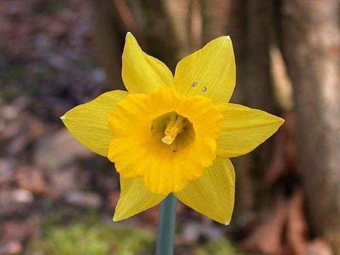|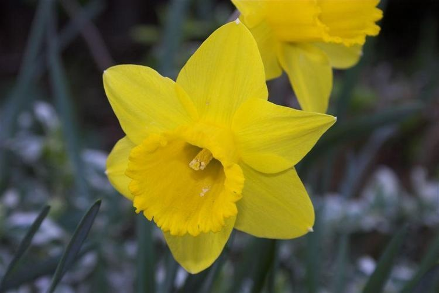|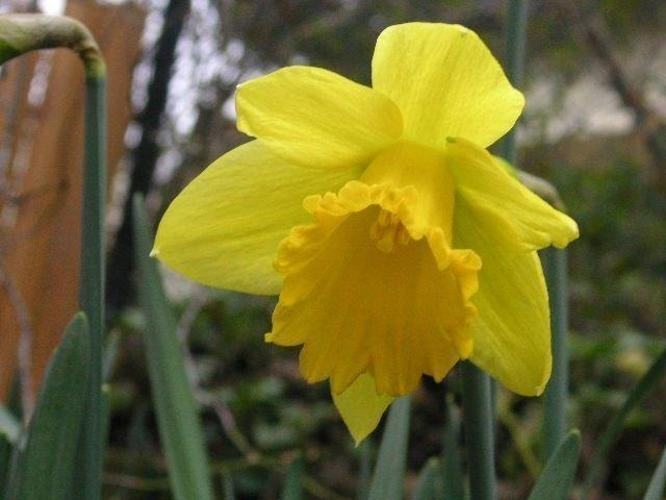|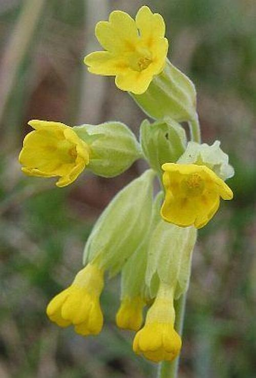|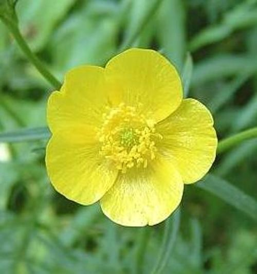|

**Distance Metric -  K-Nearest Neighbors metrics**
|Filename|Distance|
|---|---|
|image_0014.jpg|0.078|
|image_0049.jpg|0.090|
|image_1041.jpg|0.104|
|image_0016.jpg|0.107|
|image_1143.jpg|0.110|


<br>

## **Resources**
[Data - Flowers](https://www.robots.ox.ac.uk/~vgg/data/flowers/17/)
